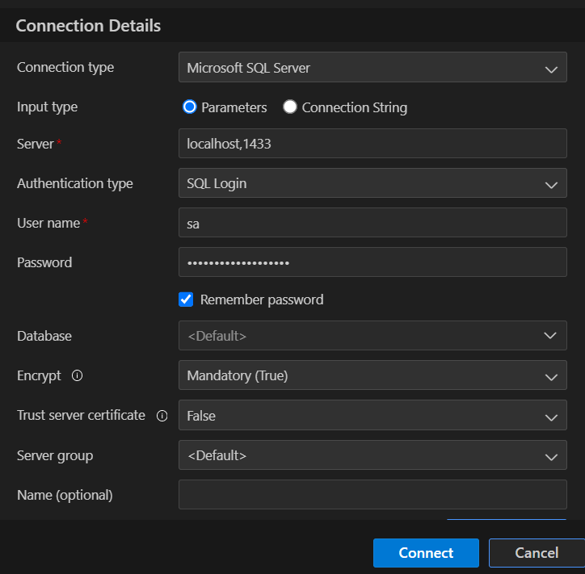
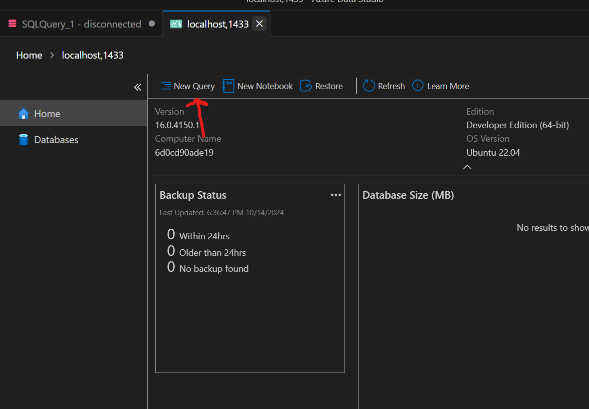
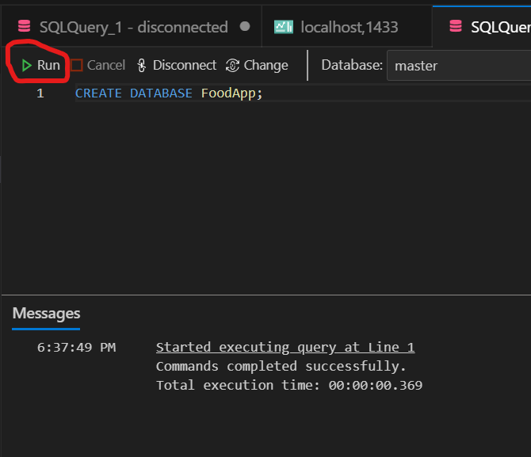
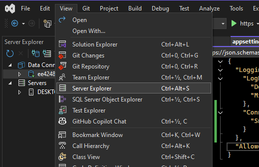
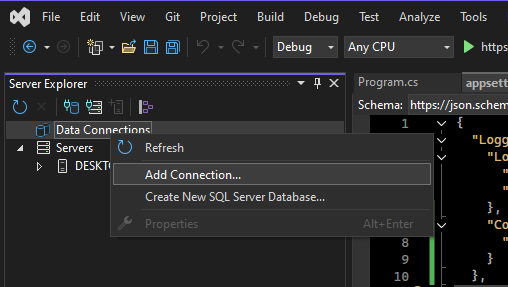
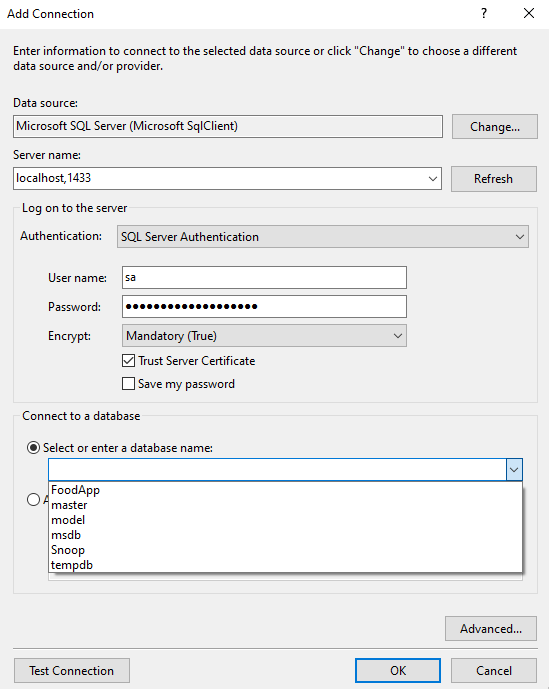
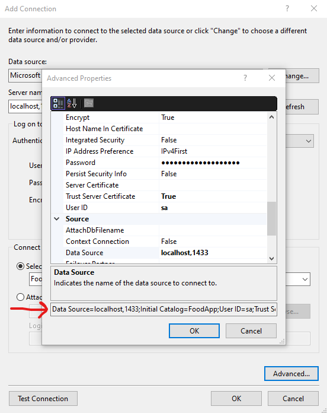
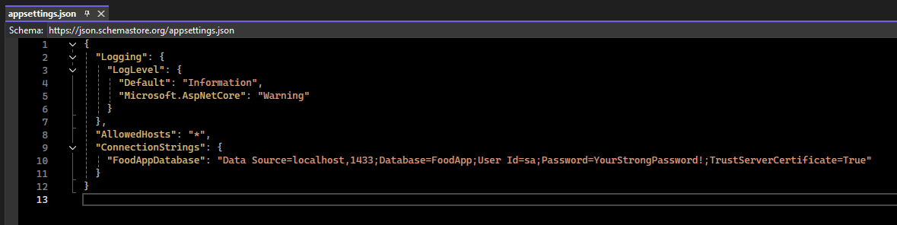
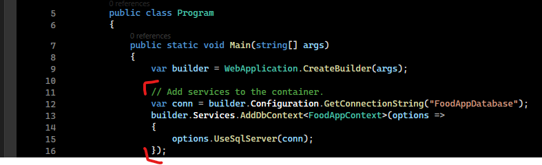

# ASP.NET Core web API development template
This template was initially made for an assignment in Aarhus University.

## Rules for this repo
- Don't commit alot of code
- Clean commits, with short descriptive text
- If working in main branch, don't use 'git add .'!

## Resources for developing ASP.NET Core Applications
- RESTful web API design: https://learn.microsoft.com/en-us/azure/architecture/best-practices/api-design
- Create web APIs with ASP.NET Core: https://learn.microsoft.com/en-us/aspnet/core/web-api/?view=aspnetcore-8.0
- Generate or find connection string: https://www.c-sharpcorner.com/UploadFile/suthish_nair/how-to-generate-or-find-connection-string-from-visual-studio/
- Serilog https://serilog.net/

## Typical Errors
If you have errors, then you might miss the obj folder. 
Try compile the program and the obj folder will be generated, then the errors should dissapear.

## Nuget packages
Remember to download following nuget packages:
- dotnet add package Microsoft.EntityFrameworkCore.SqlServer
- dotnet add package Microsoft.EntityFrameworkCore.Tools
- dotnet add package Microsoft.EntityFrameworkCore.Design
- dotnet add package Swashbuckle.AspNetCore
- dotnet add package Swashbuckle.AspNetCore.Swagger
- dotnet add package Microsoft.Extensions.Logging
- dotnet add package Microsoft.Extensions.Logging.Console


## EF Core setup
Installs the Entity Framework Core (EF-Core) CLI (dotnet-ef) tool globally on your system
- dotnet tool install --global dotnet-ef

dotnet-ef: This is the name of the tool you are installing. dotnet-ef is the command-line tool for Entity Framework Core, 
used for tasks like creating migrations, updating the database, and scaffolding a database context.

## Database setup
### Setting up an SQL Server with Docker
Pull the sql image with the following command:
- docker pull mcr.microsoft.com/mssql/server:2022-latest

Run the SQL Server Container
- docker run -e "ACCEPT_EULA=Y" -e "SA_PASSWORD=YourStrongPassword!" -p 1433:1433 --name sqlserver -d mcr.microsoft.com/mssql/server:2022-latest

Check if sql server is running in docker desktop or run this command:
- docker ps

## Connecting to SQL Server from Azure Data Studio
- Click 'New Connection'

Enter the following connection details:
Server: localhost,1433
Authentication Type: SQL Login
Username: sa
Password: YourStrongPassword!

(Remember that this is part of your connection string that you will use later in your application to connect to the database)

Click 'Connect'.



## Creating a Database
Once connected, you can create a new database using a SQL Query:

- CREATE DATABASE FoodApp





## Connecting our application to the database with the connection string (in this case FoodApp).
First assemble your connection string
- "Data Source=localhost,1433;Database=FoodApp;User Id=sa;Password=YourStrongPassword!;TrustServerCertificate=True"

### Find your connection string with Visual Studio
Sometimes you might have created a database long ago, and you don't remember what your connection string is. There is alot of ways to find your connection string,
but one way of finding it, is with Visual Studio. See the following screenshots:









### Add connection string to your ASP.NET Application
Add the following in the file: 'appsettings.json'



Add the following in the file: 'program.cs'



Now you have connected your application to the database!

## Generate C# Code based on current database schema with scaffolding tool
### This part is not needed to do, since it's already done!
If you are interested in how to do it, see the following.

- Find your connection string (See: 'Find your connection string with Visual Studio')

Run the scaffold command to genereate models and Dbcontext
- dotnet ef dbcontext scaffold "Data Source=localhost,1433;Database=FoodApp;User Id=sa;Password=YourStrongPassword!;TrustServerCertificate=True" Microsoft.EntityFrameworkCore.SqlServer -o Models

If you want to test it out and delete your current Models and DbContext then you can use the following command at the end of the scaffold command
--force

## Migration
in Entity Framework Core a migration generates a new migration file that represents the changes needed to create or update the database schema based on your current model.
Basically every time you want to create a new table, or add a new seed function or similar, you need to run a migration to update the database with the new changes.

- dotnet ef migrations add <MigrationName>

To apply the new changes to the database, you need to run the following command:
- dotnet ef database update

## Serilog Setup in ASP.NET Core
### Step 1: Add Serilog NuGet Packages
- Serilog.AspNetCore
- Serilog.Sinks.MSSqlServer

### Step 2: Configure Serilog in program.cs
Add following namespaces:
using Serilog; // Add Serilog namespace
using Serilog.Sinks.MSSqlServer; // Required for MSSQL sink

Step-by-Step Placement in Program.cs

1. Add the Serilog Setup: Add Serilog setup before creating the WebApplication builder.
2. Replace Default Logger: Configure builder.Host.UseSerilog(...) to replace the default logger.
3. Close the Logger: Ensure the logger is closed properly when the application shuts down.

Add the following code to program.cs
```csharp
Log.Logger = new LoggerConfiguration()
    .ReadFrom.Configuration(new ConfigurationBuilder().AddJsonFile("appsettings.json").Build())
    .WriteTo.File(
        "Logs/log.txt",
        outputTemplate: "{Timestamp:HH:mm:ss} [{Level:u3}] [MachineName #{ThreadId}] {Message:lj}{NewLine}{Exception}",
        rollingInterval: RollingInterval.Day
    )
    .WriteTo.MSSqlServer(
        connectionString: new ConfigurationBuilder().AddJsonFile("appsettings.json").Build().GetConnectionString("DefaultConnection"),
        sinkOptions: new MSSqlServerSinkOptions
        {
            TableName = "LogEvents",
            AutoCreateSqlTable = true
        }
    )
    .CreateLogger();
```
See file program.cs to see how serilog is configured.

## Adding Serilog enrichers

### Step 1: Add Serilog Enrichers NuGet Packages
- Serilog.Enrichers.Environment
- Serilog.Enrichers.Thread

### Step 2: Activate the enrichers
Configure the enrichers in program.cs before building the application

```csharp
builder.Host.UseSerilog((ctx, lc) =>
{
    lc.ReadFrom.Configuration(ctx.Configuration);
    lc.Enrich.WithMachineName();
    lc.Enrich.WithThreadId();
    lc.WriteTo.File(
        "Logs/log.txt",
        outputTemplate: "{Timestamp:HH:mm:ss} [{Level:u3}] {Message:lj}{NewLine}{Exception}",
        rollingInterval: RollingInterval.Day
    );
});
```

Now we have enhanced our application with Enrichers

With the WithMachineName and WithThreadId enrichers:
Every log entry includes the machine name where the application is running, useful in distributed systems or multi-server environments.
Each log entry also has the thread ID from which it originated, which is helpful for debugging multithreaded applications.

## Setting Up ASP.NET with a Website: SignalR vs. RESTful API
Missing documentation

# MongoDB - Not Only SQL

## Prerequisites
Download the following nuget packages
- Serilog.AspNetCore
- Serilog.Settings.Configuration
- Serilog.Sinks.MongoDB

Download the following MongoDB Tools
- https://www.mongodb.com/try/download/compass // Download MongoDB Compass
- https://www.mongodb.com/try/download/database-tools // Download Database CLI tools
- https://www.mongodb.com/try/download/shell // Download for MongoDB Shell Commands

## Resources
- https://learn.microsoft.com/en-us/aspnet/core/tutorials/first-mongo-app?view=aspnetcore-8.0&tabs=visual-studio // Microsoft guide on MongoDB and ASP.NET CORE
- https://www.mongodb.com/docs/manual/reference/method/js-collection/ // MongoDB Documentation
- https://github.com/ChangemakerStudios/serilog-sinks-mongodb // Serilog sink MongoDB
- https://www.adamrussell.com/asp-net-core-logging-with-serilog-to-mongodb-using-configuration // Configuring serilog with MongoDB
- https://www.youtube.com/watch?v=lgujcmQGuVQ // Video on configuring serilog sink with MongoDB

## Setup
### Step 1: Pull the MongoDB docker image
- docker pull mongo

### Step 2: Run the MongoDB docker container
- docker run -d --name mongo1 -p 27017:27017 mongo

### Step 3: Setup graphical interface for MongoDB Database with MongoDB Compass
- Download MongoDB Compass: https://www.mongodb.com/try/download/compass

Download database-tools. This will come in handy later, when we will be using 'mongorestore'
- CLI tools: https://www.mongodb.com/try/download/database-tools

Remember to set the PATH enviroment variable for bin

### Step 4: Setup MongoDB Shell for querying and interacting with MongoDB databases
- Download: https://www.mongodb.com/try/download/shell

(Remember to setup the enviroment PATH enviroment for bin)

### Step 5: Testing that MongoDB Shell works
Open a terminal and run the following command to start Mongosh Shell
- Mongosh

Now make a new database
- use Database

Test your new database with dummy data, by inserting following commands in to the terminal
```csharp
db.myNewCollection1.insertOne({ x: 1 })
```
```csharp
db.inventory.insertMany([
    { item: "journal", qty: 25, status: "A", size: { h: 14, w: 21, uom: "cm" }, tags: ["blank", "red"] },
    { item: "notebook", qty: 50, status: "A", size: { h: 8.5, w: 11, uom: "in" }, tags: ["red", "blank"] },
    { item: "paper", qty: 10, status: "D", size: { h: 8.5, w: 11, uom: "in" }, tags: ["red", "blank", "plain"] },
    { item: "planner", qty: 0, status: "D", size: { h: 22.85, w: 30, uom: "cm" }, tags: ["blank", "red"] },
    { item: "postcard", qty: 45, status: "A", size: { h: 10, w: 15.25, uom: "cm" }, tags: ["blue"] }
])
```

### Testing Selection Mongosh commands
Find all documents with status: "D":
- db.inventory.find({ status: "D" })

Find documents with both qty: 0 and status: "D":
- db.inventory.find({ qty: 0, status: "D" })

Find documents where tags contain "red":
- db.inventory.find({ tags: "red" })

Find documents where size is { h: 14, w: 21, uom: "cm" }:
- db.inventory.find({ size: { h: 14, w: 21, uom: "cm" } })
  
Find all documents (no filter):
- db.inventory.find({})

### Testing Projections (Selecting Specific Fields)
Find all documents, but only include item and status fields:
- db.inventory.find({}, { item: 1, status: 1 })
  
Find all documents, excluding only the status field:
- db.inventory.find({}, { status: 0 })

### Sorting and Limiting Results
Sort by qty in ascending order and limit to 20 documents:
- db.inventory.find({}).sort({ qty: 1 }).limit(20)
  
Skip the first 20 * page documents and limit to 20:
- db.inventory.find({}).skip(20 * page).limit(20)

### Pattern Matching (Regular Expression)
Find documents where item starts with "book":
- db.inventory.find({ item: /^book/ })

Find more on MongoDB Documentation: https://www.mongodb.com/docs/manual/reference/method/js-collection/

## Check if MongoDB is exposed to the host from docker (host = your pc)
- docker ps

Here you should see: 0.0.0.0:27017->27017/tcp

This means that your MongoDB in docker is exposed to the host and you can run commands with mongosh locally

Verify the connection:
- mongosh "mongodb://localhost:27017"

Now you can which databases you have created:
- show dbs

Now connect to your desired database:
- use Database

## Logging to MongoDB with Serilog
### Configure and add sinks in appsettings.json
(OBS. This is a different way of implementing sinks, than showed earlier. Here we are implementing all the configuration and sinks in appsettings.json, where earlier we showed sink implementation in program.cs with some configuration for minimum level in appsettings.json)

```json
{
  "AllowedHosts": "*",
  "ConnectionStrings": {
    "database": "Data Source=localhost,1433;Initial Catalog=Assignment1;Persist Security Info=True;User ID=sa;Password=YourStrongPassword!;Trust Server Certificate=True"
  },
  "Serilog": {
    "Using": [ "Serilog.Sinks.File", "Serilog.Sinks.MSSqlServer", "Serilog.Sinks.MongoDB" ],
    "MinimumLevel": {
      "Default": "Information",
      "Override": {
        "Microsoft.AspNetCore": "Warning",
        "Assignment2": "Debug"
      }
    },
    "Enrich": [ "WithMachineName", "WithThreadId" ],
    "WriteTo": [
      {
        "Name": "File",
        "Args": {
          "path": "Logs/log.txt",
          "outputTemplate": "{Timestamp:HH:mm:ss} [{Level:u3}] {Message:lj}{NewLine}{Exception}",
          "rollingInterval": "Day"
        }
      },
      {
        "Name": "MSSqlServer",
        "Args": {
          "connectionString": "database",
          "sinkOptions": {
            "tableName": "LogEvents",
            "autoCreateSqlTable": true
          },
          "columnOptions": {
            "additionalColumns": [
              {
                "ColumnName": "SourceContext",
                "PropertyName": "SourceContext",
                "DataType": "nvarchar"
              }
            ]
          }
        }
      },
      {
        "Name": "MongoDB",
        "Args": {
          "databaseUrl": "mongodb://localhost:27017/myNewDB",
          "collectionName": "logs",
          "cappedMaxSizeMb": "1024",
          "cappedMaxDocuments": "50000",
          "rollingInterval": "Month"
        }
      }
    ]
  }
}
```

Configure ASP.NET Core to use Serilog as the logging provider for the entire application. This replaces the default logging framework.
Add this code to program.cs
```csharp
// Configure Host to use serilog (Reads from appsettings.json)
builder.Host.UseSerilog((ctx, lc) =>
{
    lc.ReadFrom.Configuration(ctx.Configuration);
});
```
Now that Serilog is configured, all sinks are ready to receive log entries.

PS. We configured Serilog to log to 3 different sinks. SQL Database, a file and MongoDB. If you only wanted to log to mongodb, you would only need the following configuration in appsettings.json

```json
{
  "AllowedHosts": "*",
  "ConnectionStrings": {
    "MongoDB": "mongodb://localhost:27017/myNewDB"
  },
  "Serilog": {
    "Using": [ "Serilog.Sinks.MongoDB" ],
    "MinimumLevel": {
      "Default": "Information",
      "Override": {
        "Microsoft.AspNetCore": "Warning",
        "Assignment2": "Debug"
      }
    },
    "Enrich": [ "WithMachineName", "WithThreadId" ],
    "WriteTo": [
      {
        "Name": "MongoDB",
        "Args": {
          "databaseUrl": "mongodb://localhost:27017/myNewDB",
          "collectionName": "logs",
          "cappedMaxSizeMb": "1024",
          "cappedMaxDocuments": "50000"
        }
      }
    ]
  }
}
```

## How to Add Logging to Specific Code (e.g., a Controller)

Logging is incredibly useful and provides valuable insights into what happened during the execution of your application, particularly when clients interact with your database through requests (e.g., via your website or another application). In this section, we will explore how to add logging to different HTTP requests (POST, PUT, GET, DELETE) in a controller.
Prerequisites

Before adding logging to your code, ensure that:

Serilog is initialized in Program.cs: You must include the Serilog configuration in the builder.
Configuration is set in appsettings.json: Refer to the earlier documentation on Logging to MongoDB with Serilog for setup details.

### Adding Logging in a Controller
```csharp
[ApiController]
[Route("[controller]")]
public class ExampleController : ControllerBase
{
    private readonly ILogger<ExampleController> _logger;

    // Inject ILogger into the controller
    public ExampleController(ILogger<ExampleController> logger)
    {
        _logger = logger;
    }

    [HttpPost]
    public IActionResult CreateSomething()
    {
        _logger.LogInformation("POST request received to create a new resource.");
        // Add your logic here
        return Ok("Resource created.");
    }

    [HttpPut]
    public IActionResult UpdateSomething()
    {
        _logger.LogInformation("PUT request received to update an existing resource.");
        // Add your logic here
        return Ok("Resource updated.");
    }

    [HttpGet]
    public IActionResult GetSomething()
    {
        _logger.LogInformation("GET request received to retrieve resources.");
        // Add your logic here
        return Ok("Resources retrieved.");
    }

    [HttpDelete]
    public IActionResult DeleteSomething()
    {
        _logger.LogInformation("DELETE request received to delete a resource.");
        // Add your logic here
        return Ok("Resource deleted.");
    }
}
```

See the controllers in the .NET example code, for more in depth example

# MongoDB Driver in .NET
A MongoDB Driver is a software library provided by MongoDB or third-party developers that allows applications to interact with MongoDB programmatically. It provides an API for connecting to MongoDB, performing CRUD (Create, Read, Update, Delete) operations, and managing data. MongoDB drivers are designed to work with specific programming languages, enabling seamless integration between MongoDB and the application.

## Resources
Good examples on querying with MongoDB Driver: https://www.mongodb.com/docs/manual/tutorial/query-documents/ 

*Preferable way of querying in .NET, is with LINQ: https://www.mongodb.com/docs/drivers/csharp/current/fundamentals/linq/#overview

LINQ is often preferred for querying in .NET due to its readability and SQL-like syntax. While the standard querying approach with the MongoDB Driver allows for more detailed and customized queries, LINQ queries are strongly typed. This means the compiler checks for errors at compile time, such as incorrect field names or types, reducing runtime errors and ensuring that your queries align with your data model.

## Prerequisites
Install the following nuget package:
- dotnet add package MongoDB.Driver

## Querying logs with MongoDB Driver
For querying logs, we need to have a seperate Class/Model for logs. Furthermore we need a seperate controller and service to extract the query the data we want.

- Make a class/model for LogEntry

```csharp
using MongoDB.Bson;
using MongoDB.Bson.Serialization.Attributes;

[BsonIgnoreExtraElements]
public class LogEntry
{
    [BsonId]
    [BsonRepresentation(BsonType.ObjectId)]
    public string Id { get; set; }

    [BsonElement("Level")]
    public string Level { get; set; }

    [BsonElement("Message")]
    public string Message { get; set; }

}

```
[BsonIgnoreExtraElements] = Tells MongoDB's C# driver to ignore any extra fields in the MongoDB document that are not explicitly defined in your C# class.

[BsonId] = Marks a property as the unique identifier (ID) for the document in MongoDB. It maps to MongoDB's _id field.

[BsonRepresentation(BsonType.ObjectId)] = Specifies how the property is represented in MongoDB.

[BsonElement("Level")] = Maps a C# property to a specific field name in the MongoDB document. If the MongoDB field name doesn’t match the C# property name, you can use [BsonElement("NameOfField")] to explicitly specify the mapping.

Different models, such as LogProperties, LogInfo, and LogEntry, are needed in a logging system to ensure separation of concerns and modularity. Each model serves a distinct purpose and represents different aspects of the log data. Here's why these different models are used:

- LogEntry

Purpose: Represents the root structure of a log entry.

Why it’s needed:
    This is the top-level object that encapsulates the entire log entry.
    It contains fields like the log's unique ID (Id), the logging level (Level), the message (Message), and nested data structures like Properties.
    It represents a single log document stored in the MongoDB collection.

- LogProperties
LogProperties is used to contextual data, and give insights to e.g. http request, email adress and more.

- LogInfo
LogInfo is a nested structure within LogProperties that focuses on describing the specific operation or task being logged.

# Querying logs with Mongo Driver and Custom Enrichers

## Reference
- https://www.ctrlaltdan.com/2018/08/14/custom-serilog-enrichers/
- https://rmauro.dev/serilog-custom-enricher-on-aspnet-core/

## How it works

How Serilog Uses ILogEventEnricher:

- You create a custom enricher (like the EmailEnricher).
- You register the enricher in the Serilog configuration.
- Each time a log is written, Serilog will call the Enrich method, automatically adding the extra properties (like the user's email) to the log entries.

Here is an example on how to implement a HTTP Request custom enricher.

```csharp
public class HttpMethodEnricher : ILogEventEnricher
{
    private readonly IHttpContextAccessor _httpContextAccessor;

    public HttpMethodEnricher(IHttpContextAccessor httpContextAccessor)
    {
        _httpContextAccessor = httpContextAccessor;
    }

    public void Enrich(LogEvent logEvent, ILogEventPropertyFactory propertyFactory)
    {
        var httpMethod = _httpContextAccessor.HttpContext?.Request.Method ?? "Unknown";
        logEvent.AddPropertyIfAbsent(propertyFactory.CreateProperty("HttpMethod", httpMethod));
    }
}
```
In program.cs

```csharp
 // Configure Host to use serilog (Reads from appsettings.json)
 builder.Host.UseSerilog((ctx, lc) =>
 {
     lc.ReadFrom.Configuration(ctx.Configuration) // Reads configuration from appsettings.json
       .Enrich.With(new EmailEnricher(new HttpContextAccessor())) // Custom email enricher
       .Enrich.With(new HttpMethodEnricher(new HttpContextAccessor())); // Custom http method enricher
 });
```

As part of serilog, you can create custom Enrichers. These enrichers will enrich every log with e.g a http request, email adress or user name.

See the implementation in the following files on how to query logs.

/App/Controllers/LogController.cs | /App/CustomEnricher/... | /App/Models/LogEntry.cs...LogInfo.cs...LogProperties.cs | /App/Services/LogService.cs


