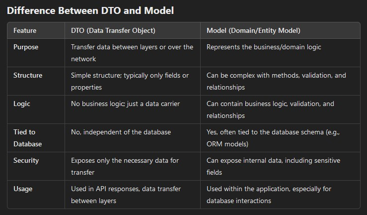
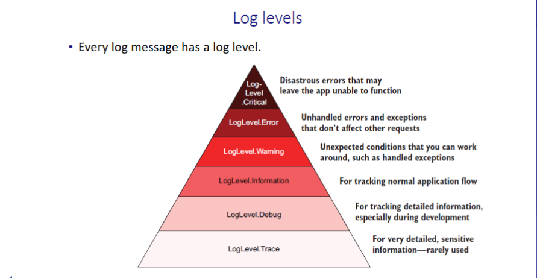
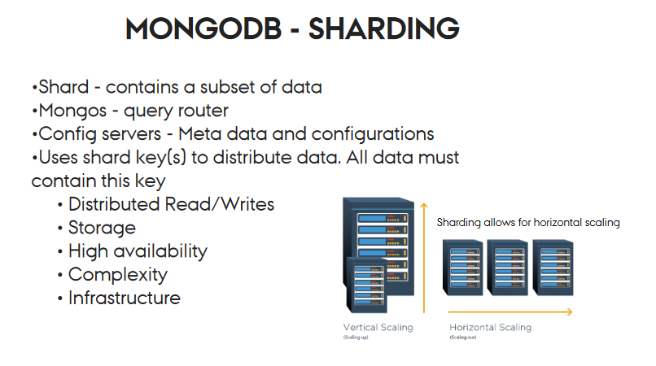
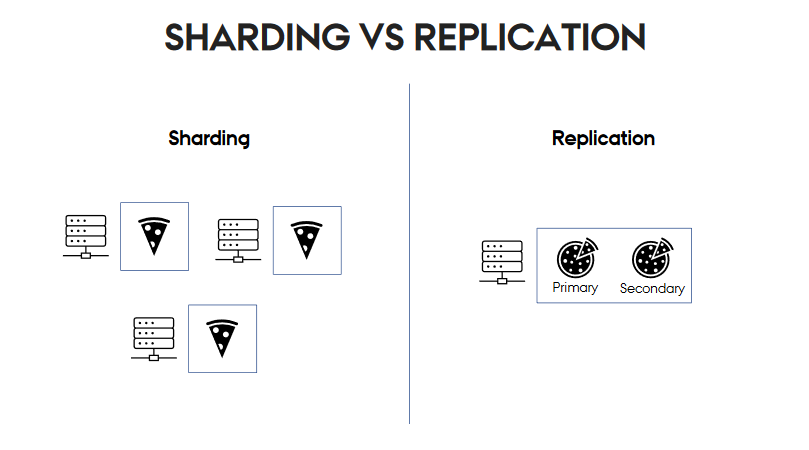

# Question and Answers
Write your questions about the code or other related topics. This will help us
better understand the code and the assignment.

## What is a connection string?
A connection string is a string used by applications to specify how to connect to a particular database
or data source. It contains all the necessary information, such as the server address, database name, user credentials, 
and other options required for establishing a connection to the database.

## What does the builder do in programcs?
The builder.Services object is used to configure all the services that your application will use, such as adding controllers, database context, authentication, logging, etc

## What is REST API
A REST API (Representational State Transfer Application Programming Interface) is a set of rules and conventions for building and interacting with web services. It allows communication between a client (eg., a web browser, mobile app) and a server over the web, typically using HTTP. REST API's are widely used in modern web and mobile applications because of their simplicity, scalability and flexibility.

Stateless: Each request from the client to the server must contain all the information the server needs to fulfill the request, without relying on any stored context on the server.

Resources: In REST, resources (like users, orders, products) are identified using URLs (Uniform Resource Locators). For example, in a REST API for a shopping site, a resource representing an order might be accessible via /orders/123.

HTTP Methods: REST APIs use standard HTTP methods to perform operations on resources:

    GET: Retrieve data from the server (e.g., fetch a list of products).
    POST: Send data to the server to create a new resource (e.g., create a new user).
    PUT: Update an existing resource (e.g., update a user's information).
    DELETE: Remove a resource (e.g., delete a product).

JSON or XML: REST APIs commonly use JSON (JavaScript Object Notation) or XML (Extensible Markup Language) to exchange data between client and server.

URI (Uniform Resource Identifier): Each resource in a REST API is accessed using a unique URI, which helps in organizing and accessing resources clearly. For example:

    /users: Accesses a collection of users.
    /users/123: Accesses a specific user with ID 123.

## What is RESTful
RESTful refers to web services or APIs that follow the architectural principles of REST (Representational State Transfer). 
REST is a design style for building scalable, maintainable, and efficient web services that communicate over the HTTP protocol. 
When a service or API is called "RESTful," it means that it adheres to the constraints and principles of REST.

## What is model binding?
Model binding is a process used in web frameworks like ASP.NET to automatically map data from HTTP requests (such as form inputs, query parameters, or route data) to parameters in controller action methods or model objects. It simplifies the task of handling user input by converting it into objects that can be directly used in the application code.

## What do Scaffolding tools do?
Scaffolding tools are used in software development frameworks (such as ASP.NET Core, Django, and Ruby on Rails) to automatically generate boilerplate code for basic CRUD (Create, Read, Update, Delete) operations. The goal of scaffolding is to speed up development by providing a starting point for common functionalities, reducing the need for manual coding.

Scaffolding in ASP.NET Core (C#)

In ASP.NET Core, scaffolding tools can generate:

    Controllers: To handle HTTP requests (e.g., GET, POST, PUT, DELETE) related to a specific entity.

    Views: Razor Pages or MVC Views to display and handle user input (HTML forms).

    Data Access Code: The code that interacts with a database, often using Entity Framework.

Example:
If we have an existing SQL Database, we can then genereate models, DbContext, controllers with the scaffolding tool.

## What is migration?
Migrations in Entity Framework (EF) are a way to manage changes to your database schema over time in a structured and version-controlled manner. Here is an overview of what migrations are and why they are used:
What Are Migrations?
    Schema Changes: Migrations are used to apply changes to the database schema, such as creating new tables, modifying existing ones, or removing them.
    Automatic Updates: Migrations allow you to automatically generate the necessary SQL commands to update your database schema based on changes in your model classes (e.g., adding a property to a model class results in a new column in the database).
    Easy Rollback: If a migration introduces a problem, you can easily revert to a previous migration, restoring the database to its prior state.

See README.md document for how to use migration in your project.

## Why use logging in EFCore applications?
Identify Issues: Logging can help you quickly identify issues within your EF Core queries or interactions with the database. 
If a query is failing or returning unexpected results, logs can provide insights into what went wrong.

Query Performance: Logging can help you monitor the performance of your database queries, including how long they take to execute. 
You can identify slow-running queries and optimize them accordingly.

Log SQL Queries: Use logging to capture the SQL generated by EF Core. 
This can help you understand what queries are being executed and if they are optimized.

## What is an [ApiController]
An [ApiController] in ASP.NET Core is an attribute used to mark a class as a Web API controller. This attribute provides specific conventions and behavior that are optimized for building RESTful APIs. 
It simplifies tasks like model validation, binding data from requests, and generating standardized error responses.

## What is an seed function and how do you implement it?
A seed function is used to seed dummy data to the database. It can be implemented as a class, as following:
.\Data\Seeder.cs
```C#
namespace EFSolution.Data
{
    public class Seeder
    {
        // Seed method
        public static void Seed(FoodAppContext context)
        {
            // Check if the database has been seeded
            if (!context.Dishes.Any())
            {
                context.Dishes.AddRange(new List<Dish>
                {
                    new Dish { DishName = "Potatoes with sauce", Price = 10.0m },
                    new Dish { DishName = "Rice and beef", Price = 20.0m },
                    new Dish { DishName = "Spagetti and sauce", Price = 30.0m },
                });

                context.SaveChanges(); // Save changes to the database
            }
        }
    }
}
```

Then added to program.cs to call the function to seed the database as following:
.\program.cs
```C#
// Seed the database
using (var scope = app.Services.CreateScope())
{
    var context = scope.ServiceProvider.GetRequiredService<FoodAppContext>();
    context.Database.Migrate(); // Ensure database is up to date
    Seeder.Seed(context); // Call the Seeder method to seed the database
}
```

## What is an DTO?
A DTO (Data Transfer Object) is a simple object used to transfer data between different layers of an application. It is often used to reduce the amount of data being sent over the network and to protect the internal structure of the application by exposing only the necessary information.

Purpose: It acts as a container to move data between layers, such as from a controller to a view, or between services.
Structure: Typically a lightweight object with just fields or properties. It does not contain business logic or methods, just data.



Example on a DTO:
```C#
public class UserDto
{
    public int Id { get; set; }
    public string Name { get; set; }
    public string Email { get; set; }
}
```

Example on a Model:
```C#
public class User
{
    public int Id { get; set; }
    public string Name { get; set; }
    public string Email { get; set; }
    public string PasswordHash { get; set; } // sensitive info
}
```

## Why do we use DTO, and why not just use Models?
Security Concerns:

Models often represent the database schema and include sensitive fields (e.g., passwords, personal data, internal identifiers). Exposing these fields directly to external systems or clients (via APIs, for example) could lead to security risks. DTOs allow you to limit the data that is shared.
For example, if you expose a User model, it might include sensitive information like passwords or internal IDs. Using a UserDTO can help ensure only non-sensitive data (like name, email, etc.) is sent.

Separation of Concerns:

Models are often closely tied to your database and internal business logic, while DTOs are meant for communication with external systems, such as APIs or different application layers. If your models change (e.g., due to database schema changes), those changes can unintentionally affect external clients if you're using models directly. DTOs provide a buffer between your internal data structures and external interfaces.

Performance:

Models often include large amounts of data that aren't always necessary for the external world. Using DTOs allows you to transfer only the necessary information, reducing the size of the payload, which can improve performance when dealing with APIs.

## What is a query?
A query generally refers to a request for information or data, often from a database. The meaning of "query" can vary slightly depending on the context, but it typically involves retrieving or interacting with data based on specific conditions.

Here are common uses of the term "query" in different contexts:

Database Query:
    In databases, a query is a request for information. It is written in a language like SQL (Structured Query Language) to retrieve, insert, update, or delete data from a database.
    Example: In SQL, a query to retrieve all users from a table might look like this:

SELECT * FROM Users;

## What is a logger in ASP.NET Core
In ASP.NET Core, a logger is a component responsible for recording log messages, which can include information about the application's flow, error details, debugging information, warnings, and other runtime events.

In ASP.NET Core, a logger is a component responsible for recording log messages, which can include information about the application's flow, error details, debugging information, warnings, and other runtime events. Loggers play a crucial role in monitoring, troubleshooting, and debugging applications by providing insights into how the application is performing and helping identify issues in production or during development.

### Key Concepts of a Logger in ASP.NET Core

1. ILogger Interface:
    ASP.NET Core uses the ILogger interface for logging. This interface provides methods for logging messages at different severity levels (e.g., Information, Warning, Error).
    Loggers are typically obtained through dependency injection in ASP.NET Core, making them easy to use in any part of the application.

2. Logging Providers:
    ASP.NET Core logging is provider-based, which means you can plug in different logging providers to control where the logs are written.
    Built-in providers include the Console, Debug (for Visual Studio output), and Event Log providers. You can also add third-party providers, like Serilog, NLog, and Log4Net.

3. Log Levels:
    The logger allows you to specify log levels to categorize the importance of each log message. Common log levels include:
        Trace: Detailed information, typically only useful for debugging.
        Debug: Information that might be helpful in development.
        Information: General information about the application’s flow.
        Warning: Indicates a potential issue or unusual situation.
        Error: A problem that has occurred, but the application can still continue.
        Critical: A severe problem that could cause the application to terminate.

4. Log Scopes:
    Scopes are used to group a set of log entries together. For example, all log entries for a particular HTTP request could be grouped within a single scope.
    Scopes provide additional context that can be helpful in troubleshooting.

### Understanding Minimum Level Logging


In the pyramid above, setting a minimum level of "Information" means that all logging events at Information level and above (Warning, Error, Critical) will be logged. Lower levels, such as Trace and Debug, will not be recorded unless specified otherwise.

Here’s an example configuration in appsettings.json:

```csharp
"Serilog": {
  "MinimumLevel": {
    "Default": "Information",
    "Override": {
      "Microsoft": "Warning",
      "MyAppNamespace": "Debug"
    }
  }
}
```
In this example:

- "Default": "Information": Sets the default minimum logging level for the entire application to Information. This means that, by default, only Information, Warning, Error, and Critical logs will be recorded.
- Override: 
1. "Microsoft": "Warning": Overrides the default logging level specifically for logs from the Microsoft namespace. Only Warning and above logs (Error, Critical) will be recorded for Microsoft-related events.
2. "MyAppNamespace": "Debug": Sets the minimum level for MyAppNamespace to Debug, allowing logs at Debug level and above (Information, Warning, Error, Critical) for this specific namespace.

This configuration helps you control logging verbosity for different parts of your application, reducing noise from external libraries while enabling more detailed logs in specific areas where needed.

## What are enrichers in serilog?
In Serilog, enrichers are components that automatically add extra information (properties) to each log event. This additional context can help make logs more informative and easier to filter, search, and analyze.

### Common Use Cases for Enrichers

Enrichers are often used to add context that can help you understand the environment or circumstances around a log entry, such as:

Machine Information: Enrichers can add properties like the machine name or IP address, which can help identify the server or computer where the log was generated.
User Information: Enrichers can add user-specific information, such as user ID or username, which is useful in applications where you need to track user actions.
Environment Details: You can add the environment (e.g., development, staging, production) as a property to distinguish logs from different environments.
Request and Correlation IDs: Enrichers can add unique IDs for requests or transactions, which is useful for tracking a series of related log entries across distributed systems.

### How to Use Enrichers in Serilog

Serilog includes some built-in enrichers, and you can also create custom enrichers.
Built-in Enrichers

Serilog provides several enrichers out of the box. Some examples include:

Enrich.WithMachineName(): Adds the machine name to each log event.
Enrich.WithThreadId(): Adds the thread ID to each log event.
Enrich.WithEnvironmentUserName(): Adds the environment username (current user running the application).
Enrich.FromLogContext(): Allows adding properties to specific log events within a scope using LogContext.PushProperty.

## What is MongoDB?

MongoDB is a popular, open-source NoSQL database designed for handling large volumes of unstructured data. Unlike traditional relational databases, MongoDB stores data in a flexible, document-oriented format using JSON-like structures called BSON (Binary JSON), allowing for schema flexibility and scalability.
Key Features

- Document-Oriented: Data is stored as documents (similar to JSON), making it easy to represent complex data structures.
- Schema Flexibility: MongoDB doesn’t require a fixed schema, allowing for agile development.
- Horizontal Scalability: Supports sharding, enabling data distribution across multiple servers.
- Rich Query Language: Includes powerful querying and aggregation capabilities.

## What is Sharding?
Sharding is a database partitioning technique used by MongoDB to distribute large datasets across multiple servers, or shards. This helps in managing and scaling a database to handle high volumes of data and traffic. Sharding is particularly useful for horizontally scaling a MongoDB deployment, allowing it to accommodate growing data and workloads.

### What does scaling horizontally mean?



### Example of Sharding in MongoDB
Example of a Sharded MongoDB Cluster

Suppose you have an application with a large dataset, such as a social media platform that stores millions of user profiles. Managing all this data on a single MongoDB server could lead to performance issues, so you decide to use sharding to distribute the data across multiple servers (shards).
#### Step 1: Choose a Shard Key

The shard key is a field that determines how data is distributed across shards. In this example, let’s use the userId field as the shard key. MongoDB will use this key to decide where each user profile document should be stored.
#### Step 2: Set Up Shards

Let’s say you set up three MongoDB servers, each serving as a shard in your sharded cluster:

    Shard 1: Stores users with userId values from 1 to 1 million.
    Shard 2: Stores users with userId values from 1 million to 2 million.
    Shard 3: Stores users with userId values from 2 million to 3 million.

Each shard holds only a portion of the data, so no single server has to store all user profiles.
#### Step 3: Data Distribution

When a new user profile is added to the platform, MongoDB determines the shard based on the userId:

    If userId is 500,000, MongoDB stores it in Shard 1.
    If userId is 1,500,000, MongoDB stores it in Shard 2.
    If userId is 2,500,000, MongoDB stores it in Shard 3.

Each shard is responsible for a subset of data, allowing MongoDB to distribute storage and query load across multiple servers.
#### Step 4: Querying the Sharded Cluster

When the application queries for a user profile (e.g., userId: 1,500,000), MongoDB’s query router (using the mongos process) determines which shard holds the data for that userId and directs the query to Shard 2.

If you run a query that spans multiple userId values (e.g., finding users between 1,000,000 and 2,000,000), MongoDB can query both Shard 2 and Shard 3 simultaneously, speeding up the response time.
#### Step 5: Data Growth and Shard Rebalancing

As your user base grows, one shard may become overloaded. MongoDB automatically rebalances the data by moving chunks of data (small pieces of the dataset) from heavily loaded shards to less loaded shards. For example, if Shard 1 becomes too full, some of its user profile data may be moved to Shard 2.
Summary of This Sharding Example

- Shard Key: userId, which distributes data across shards.
- Shards: Each shard holds a subset of the data based on userId values.
- Query Routing: The query router directs requests to the correct shard(s) based on the shard key.
- Rebalancing: MongoDB can move chunks of data between shards as data grows to ensure an even distribution.

This sharding setup helps MongoDB handle large volumes of data efficiently by distributing storage and load across multiple servers, improving performance, and allowing the application to scale horizontally as data grows.
